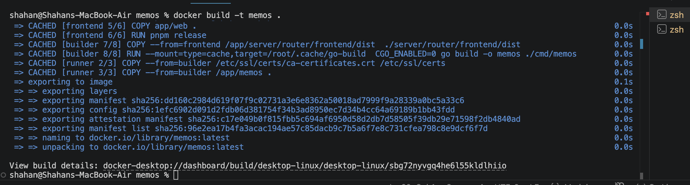
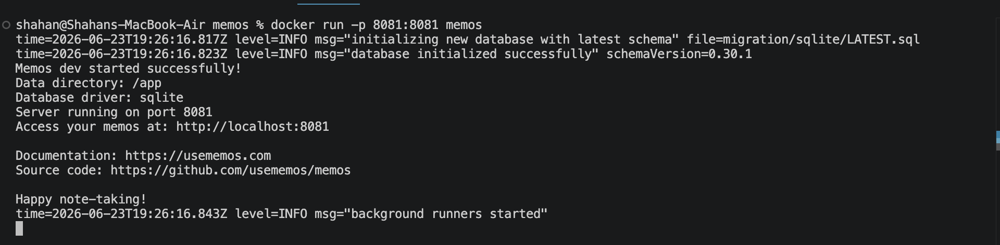
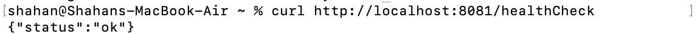

# ECS Fargate Memos App

This project delivers a production-grade, end-to-end deployment of a privacy-focused memo application on Amazon Web Services using Amazon ECS Fargate. It utilises Docker for containerisation, Terraform for infrastructure as code, and GitHub Actions to automate both infrastructure provisioning and application delivery. The solution is designed to be secure, scalable, and production-ready, incorporating HTTPS encryption, persistent storage for .tfstates, and a fully automated CI/CD pipeline to ensure consistent and repeatable deployments.

## Overview

Containerisation: Multi-stage builds using `scratch` base image to reduce image size to ~30MB
Infrastructure as Code (IaC): Terraform manages all infrastructure, fully automated
Compute: AWS ECS Fargate
Networking: Custom VPC, Private/Public Subnets Alongside NAT Gateways, Routes, Security Groups, Load Balancing
TLS/DNS: SSL Certifcation configured via ACM, DNS (Cloudflare)
CI/CD: Builds Image, pushes to ECR and updates ECS, Automated Unit Tests, Automated IaC deployment.
Registry: Docker image hosted in AWS ECR

## Demo


## Architecture


**Traffic flow:**

```
User --> queries Route53 (memos.shahankhan.co.uk) --> Route53 resolves to ALB --> ALB redirects any HTTP(port 80) traffic to HTTPS(Port 443) --> ALB directs traffic to Target Group (ECS Fargate Task)
```

| Design Decision                           | Rationale                                                                                                                      |
| :---------------------------------------- | :----------------------------------------------------------------------------------------------------------------------------- |
| **Compute: ECS Fargate**                  | Provides serverless container orchestration, removing the operational overhead of managing EC2 instances.                      |
| **IaC: Terraform**                        | Ensures idempotenecy, ensures reproducible infrastructure and automated state management.                                      |
| **State Management: S3 + Native Locking** | S3 used for `.tfstate` locking (`use_lockfile = true`), eliminating the need for external database dependencies like DynamoDB. |
| **All traffic handled by ALB**            | Provides SSL/TSL Termination, High availability, Allows ECS tasks to be completely isolated.                                   |
| **Network: Public/Private VPC**           | Ensures secure application isolation by placing ECS tasks in private subnets with controlled NAT gateway access.               |

### Project Structure

```
memos-infra/
├── .github/
│   └── workflows/
│       ├── docker-buildPush.yml
│       ├── terraformDeploy.yml
│       └── unittests.yml
├── app/                    # Memos application source/config
├── infra/                  # Terraform infrastructure code
│   ├── modules/            # Reusable resource modules
│   │   ├── alb/            # Load Balancer configuration
│   │   ├── ecs/            # Fargate task and service definitions
│   │   ├── iam/            # IAM roles and execution policies
│   │   ├── route53/        # DNS record management
│   │   ├── sg/             # Security Group rules
│   │   └── vpc/            # Networking and subnet architecture
│   ├── main.tf             # Root infrastructure entry point
│   ├── output.tf           # Infrastructure outputs
│   ├── providers.tf        # AWS provider and backend configuration
│   ├── variables.tf        # Input variable definitions
│   └── terraform.example.tfvars #Example of .tfvars file required
├── infra-prereq/           # Pre-deployment setup scripts
├── Dockerfile              # Container definition for Memos
├── docker-compose.yml      # Local development orchestration
├── .dockerignore
├── .gitignore
└── README.md
```

## Local Setup (Quick start)

**Prerequisites:** Docker

```
docker build -t memos . #To build image
```



```
docker run -p 8081:8081 memos #Start the Container
```



You can run a health check via:
`curl http://localhost:8081/healthCheck`



Open `http://localhost:8081` and start writing!

## Infrastructure
**Custom VPC:** Consisting of 2 public subnets and 2 Private subnets across 2 AZ's. Ensuring high availability.

**Internet Gateway + NAT Gateway:** Internet gateway enabling bidirectional traffic, with NAT Gateway providing secure outbound access for private subnets.

**Route53:** Provides DNS Resolution for domain `(memos.shahankhan.co.uk)` to ALB via Alias record

**Application Load Balancer:** Handles all traffic into VPC on port 80/443. Handles SSL/TLS Termination and redirects HTTP traffic to HTTPS. Provisoned across subnets in AZ's. SSL/TLS Cert handled by AWS ACM. Moving traffic to appropriate target group

**ECS/Fargate:**Serverless container orchestration. Provisoned across multiple AZ's ensuring high avialability.

**S3 Bucket:** `.tfstate` is stored in secure S3 bucket with native locking enabled. Ensuring idempotency and and prevent concurrent modification by multiple users or processes.

## Security Profile
- **IAM OIDC Identity Providers:** GitHub Actions workflows communicates with AWS securely using OpenID Connect roles. No permanent AWS credentials or tokens are stored in the repo.

- **Network Isolation:** The application container layer possesses zero public IP addresses. It is locked inside a private subnet layer protected by stateful security groups that only accept incoming inputs on port 8081 stemming exclusively from the ALB's security group ID.

## Setup Order & Prerequisites

Before running the automated deployment pipelines, the backend state storage and GitHub authentication paths must be provisioned manually.

### 1. Bootstrap the S3 Backend (`infra-prereq/`)
Because Terraform requires an existing S3 bucket to store its state file securely, you must initialize and apply the prerequisites configuration first.

```bash
cd infra-prereq/
terraform init
terraform apply -auto-approve
```
### 2. Configure GitHub Secrets
avigate to your repository on GitHub (Settings > Secrets and variables > Actions) and create the following repository secrets:

| Secret Name | Description | Example / Format |
| :--- | :--- | :--- |
| `ACTIONS_GITHUB_ROLE_ARN` | The AWS IAM Role ARN configured with an OIDC trust policy to allow GitHub Actions to authenticate without long-lived keys. | `arn:aws:iam::123456789012:role/github-actions-role` |
| `TFVARS_BASE64` | A **Base64-encoded** string of your complete `terraform.tfvars` file. This is dynamically decoded by the pipeline at runtime. | *See instructions below* |

### How to generate the `TFVARS_BASE64` secret

To prevent exposing raw sensitive infrastructure variables, populate your local `infra/terraform.tfvars` file first, then convert it to a Base64 string using your terminal:

```bash
# On macOS / Linux:
cat infra/terraform.tfvars | base64 | pbcopy  # Copies the encoded string straight to your clipboard
```

## CI/CD Pipelines

Three decoupled pipelines, each with a single responsibility:

| Pipeline | Trigger | Purpose / Key Steps |
| :--- | :--- | :--- |
| **docker-build.yaml** <br>*(Docker-Build-And-Push-Image)* | `workflow_dispatch` <br>(Manual with inputs for cluster, service, & domain) | Authenticates via AWS OIDC, logs into ECR, builds/pushes the Docker image with GHA caching (`:latest`), forces an ECS service deployment update, and runs a post-deploy HTTPS health check against the live domain. |
| **tf-deploy.yaml** <br>*(Terraform Deploy)* | `workflow_dispatch` <br>(Manual) | Decodes the base64 `tfvars` secret, authenticates via AWS OIDC, initializes HashiCorp Terraform, validates configurations, runs a `terraform plan`, and automatically executes `terraform apply -auto-approve` to provision infra. |
| **ci.yaml** <br>*(Continuous Integration)* | `push` <br>(Triggers on any code push) | Automatically spins up Node.js v24 inside the `./app/web/tests` working directory, installs npm dependencies, and executes the automated unit/integration test suite (`npm test`). |


